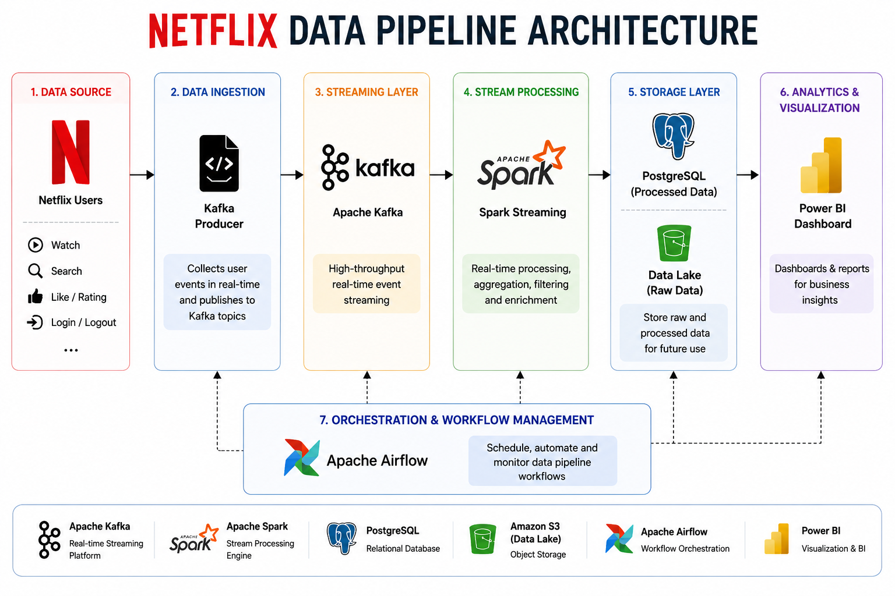

# Netflix Analytics Dashboard

---
# Netflix Data Processing Pipeline

## Architecture



## Dashboard


## Team Members

- Shariq Ali Mohammad
- Shiva Sai Addanki
- Sajan
- Sai vinay pyatla
- Sankara vamsi raju sarikonda

## Technologies Used

- Apache Kafka
- Apache Spark
- Apache Airflow
- PostgreSQL
- Docker

## Pipeline Flow

Netflix Users
→ Kafka Producer
→ Kafka Broker
→ Spark Streaming
→ PostgreSQL
→ Dashboard

# Netflix Analytics Dashboard

## Features

- Interactive Genre Filters
- Country Analytics (100+ Countries)
- Movie vs TV Show Analysis
- Ratings Distribution
- Release Year Trends
- Top Directors
- Search Netflix Titles

## Technologies

- Python
- Pandas
- Streamlit
- Plotly
- Kafka
- Spark
- Airflow
- PostgreSQL

## Run

```bash
pip install -r requirements.txt
streamlit run dashboard/app.py
```
