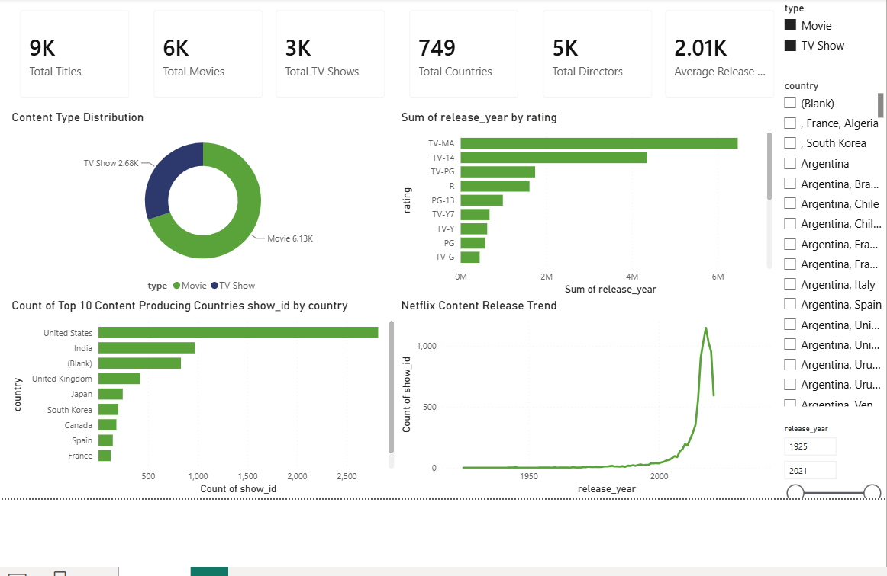
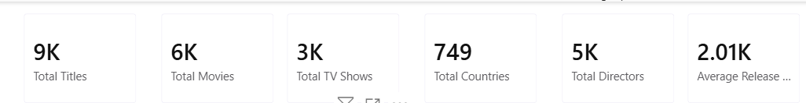
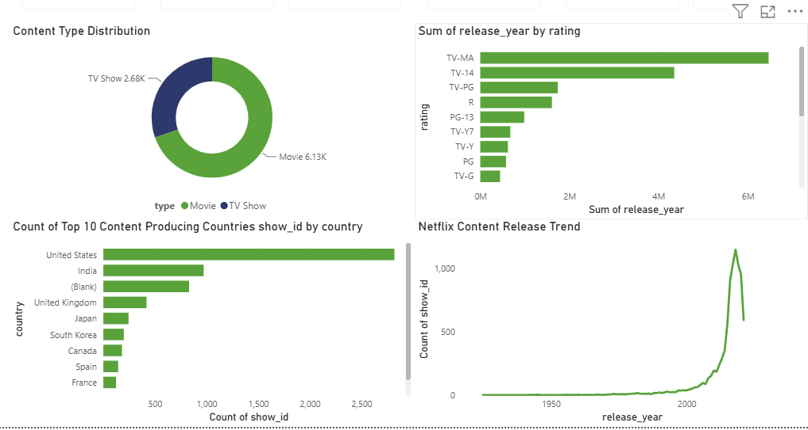
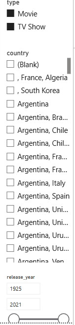

# 🎬 Netflix Data Engineering Pipeline & Analytics Dashboard

A complete end-to-end **Data Engineering** project demonstrating how Netflix data can be ingested, transformed, orchestrated, stored, and visualized using modern data engineering technologies.

This project integrates **Apache Spark**, **Apache Kafka**, **Apache Airflow**, **PostgreSQL**, **Docker**, **Power BI**, and **Streamlit** to build a scalable ETL pipeline and interactive analytics dashboards.

---

# 📌 Project Overview

The project simulates a real-world data engineering workflow consisting of:

- Data Ingestion using Apache Spark
- Data Cleaning & Transformation
- Workflow Orchestration using Apache Airflow
- SQL Layer using PostgreSQL
- Kafka-based Streaming Architecture
- Docker Containerization
- Business Intelligence Dashboard using Power BI
- Interactive Live Dashboard using Streamlit

---

# 👨‍💻 Team Members

- Mohammad Shariq Ali
- Shiva Sai Addanki
- Sankara Vamsi Raju Sarikonda
- Sai Vinay Pyatla
- Sajan

---

# 🛠 Technologies Used

| Technology | Purpose |
|------------|---------|
| Apache Spark | Data Processing |
| Apache Kafka | Data Streaming |
| Apache Airflow | Workflow Orchestration |
| PostgreSQL | SQL Database |
| Docker | Containerization |
| Power BI | Business Intelligence Dashboard |
| Streamlit | Interactive Dashboard |
| Python | Backend Development |
| Pandas | Data Analysis |

---

# 🏗 Project Architecture

The overall architecture of the data engineering pipeline is shown below.


---

# 🔄 Pipeline Workflow

```
Netflix Dataset
        │
        ▼
Apache Spark Data Ingestion
        │
        ▼
Data Cleaning & Transformation
        │
        ▼
Apache Kafka
        │
        ▼
Apache Airflow
        │
        ▼
PostgreSQL
        │
        ▼
Power BI Dashboard
        │
        ▼
Streamlit Live Dashboard
```

---

# 📂 Project Structure

```
netflix-data-pipeline/
│
├── airflow/
│   ├── dags/
│   ├── docker-compose.yml
│   ├── logs/
│   └── plugins/
│
├── Spark/
│   ├── scripts/
│   └── config.py
│
├── Producer/
│
├── sql/
│   └── create_tables.sql
│
├── dashboard/
│   └── app.py
│
├── powerbi/
│   ├── screenshots/
│   └── dashboard.pbix
│
├── images/
│
├── data/
│
├── output/
│
├── README.md
│
└── requirements.txt
```

---

# ⚙️ Data Engineering Pipeline

## Phase 1 – Data Ingestion

Apache Spark loads the Netflix dataset.

### Tasks

- Read CSV Dataset
- Infer Schema
- Display Records
- Convert CSV to Parquet

---

## Phase 2 – Data Transformation

Apache Spark performs preprocessing.

### Tasks

- Remove Duplicate Records
- Handle Missing Values
- Trim String Columns
- Convert Date Formats
- Cast Data Types
- Store Cleaned Dataset

---

## Phase 3 – Apache Kafka

Kafka simulates a streaming data pipeline.

Components

- Zookeeper
- Kafka Broker
- Kafka Producer

---

## Phase 4 – Apache Airflow

Airflow orchestrates the Spark ETL workflow.

Pipeline Tasks

- Data Ingestion
- Data Transformation

Airflow manages scheduling, execution, monitoring, and dependency management of the ETL pipeline.

---

## Phase 5 – SQL Layer

The processed data is stored in PostgreSQL.

Implemented Features

- Database Creation
- Table Creation
- Structured Data Storage
- SQL Query Support

---

## Phase 6 – Dashboard Layer

Business insights are generated using both Power BI and Streamlit.

---

# 📊 Streamlit Live Dashboard

The project includes an interactive Streamlit dashboard for exploring Netflix content.

### Features

- Search Netflix Titles
- Genre Analysis
- Country Analysis
- Movie vs TV Show Distribution
- Rating Distribution
- Release Year Trends
- Interactive Charts

### Live Dashboard Preview


---

# 📈 Power BI Dashboard

The Power BI dashboard provides business intelligence and interactive reporting.

---

## Dashboard Overview



---

## KPI Cards

The dashboard displays key metrics including:

- Total Titles
- Movies
- TV Shows
- Countries
- Directors



---

## Dashboard Charts

The dashboard includes visualizations for:

- Movie vs TV Shows
- Genre Distribution
- Country Distribution
- Ratings Analysis
- Release Year Trends
- Top Directors



---

## Interactive Filters

Users can filter by:

- Country
- Genre
- Rating
- Type
- Release Year



---

# 📊 Dataset Information

Dataset

Netflix Movies and TV Shows Dataset

Dataset contains

- Movies
- TV Shows
- Directors
- Cast
- Countries
- Ratings
- Genres
- Release Years
- Duration
- Date Added

---

# 📈 Dashboard Features

## Power BI

- Interactive KPI Cards
- Genre Analytics
- Country-wise Analysis
- Movie vs TV Show Comparison
- Release Year Trends
- Ratings Analysis
- Dynamic Filters

---

## Streamlit

- Interactive Dashboard
- Search Functionality
- Plotly Visualizations
- Live Filtering
- Dataset Statistics
- User-Friendly Interface

---

# 🚀 Running the Project

## Clone Repository

```bash
git clone https://github.com/Shariq7427/netflix-data-pipeline.git

cd netflix-data-pipeline
```

---

## Install Requirements

```bash
pip install -r requirements.txt
```

---

## Run Spark Data Ingestion

```bash
python -m Spark.scripts.01_data_ingestion
```

---

## Run Spark Data Transformation

```bash
python -m Spark.scripts.02_data_transformation
```

---

## Start Kafka

```bash
docker compose up -d
```

---

## Start Airflow

```bash
cd airflow

docker compose up -d
```

Open

```
http://localhost:8080
```

Default Credentials

Username

```
admin
```

Password

```
admin
```

---

## Run Streamlit Dashboard

```bash
streamlit run dashboard/app.py
```

---

# 📊 Business Insights

The dashboards answer important business questions such as:

- Which country produces the most Netflix content?
- What are the most popular genres?
- Movie vs TV Show distribution
- Ratings distribution
- Release year trends
- Top contributing directors
- Country-wise content production

---

# 🚀 Future Enhancements

- Real-Time Kafka Streaming
- Spark Structured Streaming
- Cloud Deployment (AWS / Azure / GCP)
- Machine Learning Recommendation Engine
- Automated CI/CD Pipeline
- Data Validation Framework
- Cloud Data Warehouse Integration

---

# 📷 Project Demonstration

## Architecture


---

## Streamlit Dashboard


---

## Power BI Dashboard


---

## KPI Cards


---

## Charts


---

## Filters


---

# 📄 License

This project was developed for academic purposes as part of the Master's in Data Engineering coursework.

---

# 🙏 Acknowledgements

Special thanks to our course instructor and project team for their valuable guidance and support throughout the development of this project.

---

# 👨‍💻 Developed By

**Mohammad Shariq Ali**

Master's in Data Engineering

2026